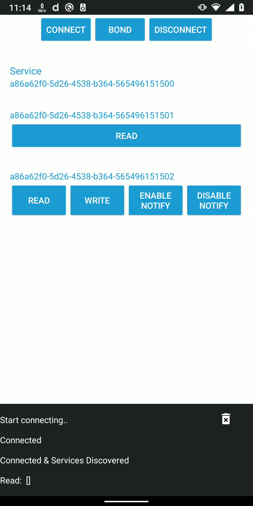
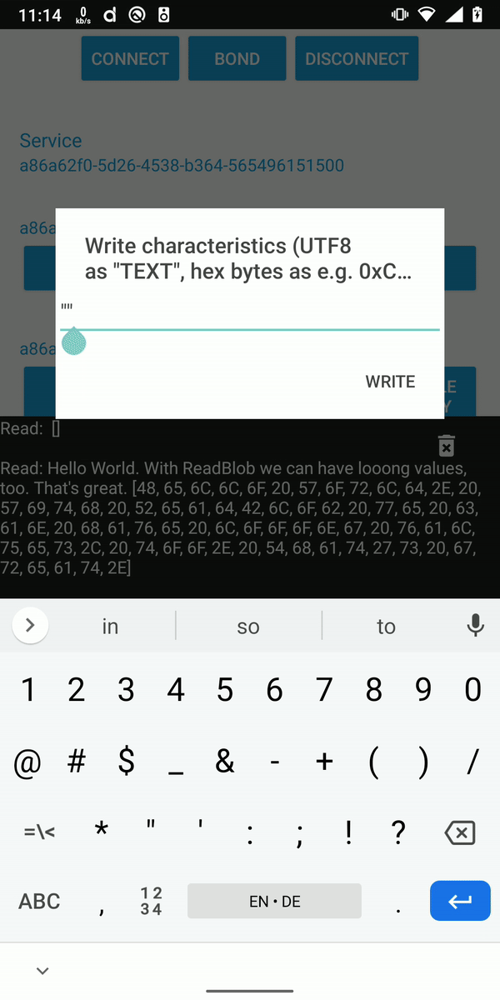
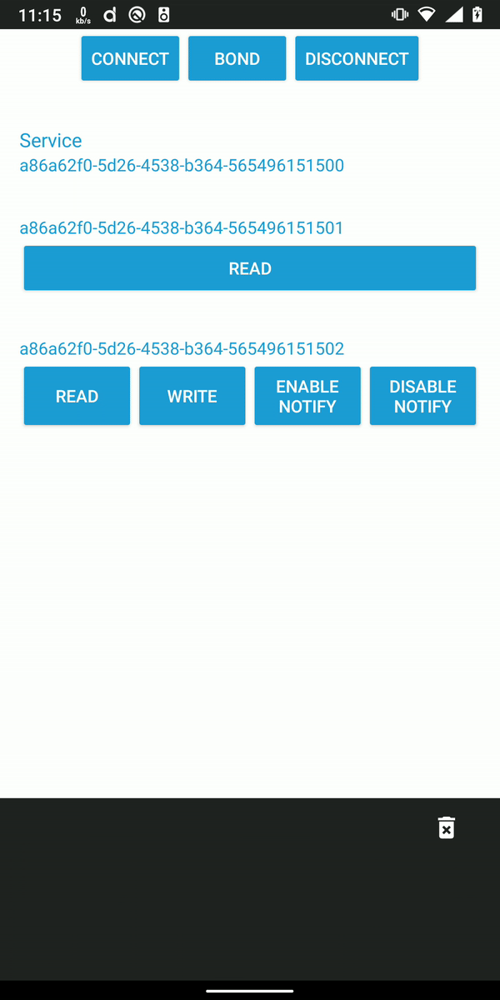

# Example for Rubble NRF52832 without using RTIC

It should just work with the NRF52DK.

There is a lot of unsafe code needed since resources need to be accessible from the interrupt routines.

Therefore it's better to use RTIC but this shows how to do it without.

This currently uses a local fork of Rubble with some additions.

Logging is done via RTT so I guess bbqueue isn't needed and logging is quite simple here.

All the code is just inside `main.rs` 

This also shows some additional functionality I added to Rubble
- ReadBlob
- Read Attributes with dynamic length and content
- Prepare Write + Execute Write
- FindInformation (needed to make notifications work with Android)

## Read Long Value

## Write Long Value

## Notify

